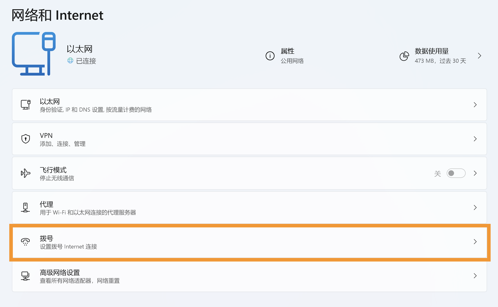
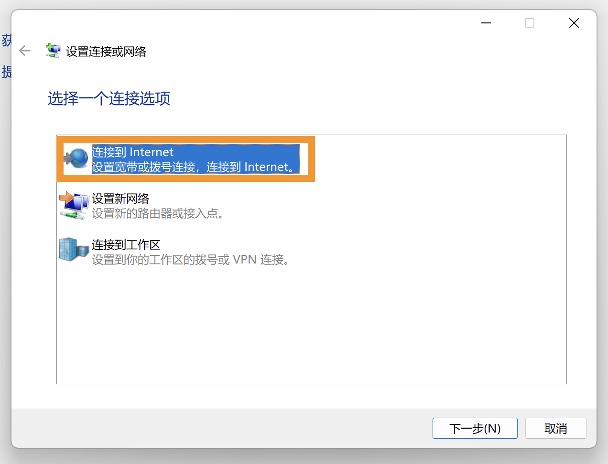
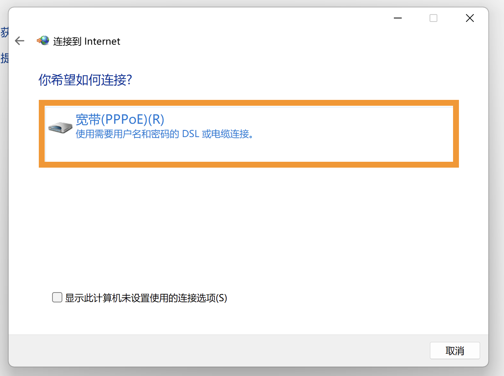
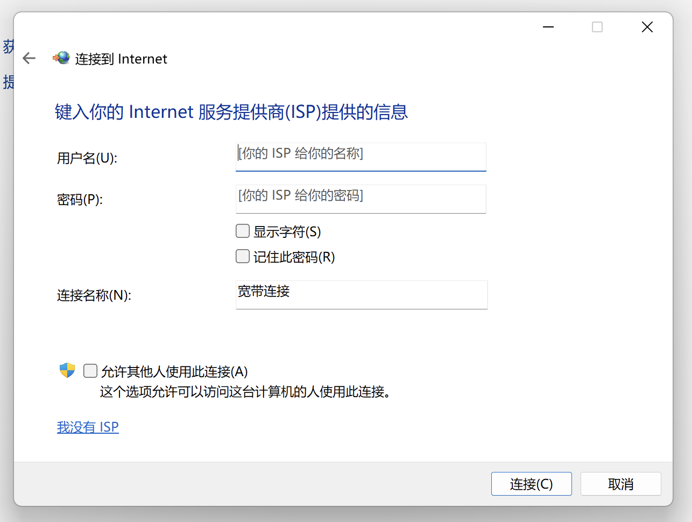

本文旨在为**宿舍**内的联网提供详细指南。

## 确认类型

宿舍的网络有两种类型，**我们可以通过两种方法区分**：

首先，我们可以打开手机/电脑，通过查看是否有**名为 `iFudan.stu` 的 Wi-Fi**

**➡️若有名为 `iFudan.stu` 的 Wi-Fi，[👉请戳我](#四网合一改造后的宿舍网络连接)**

**➡️若没有名为 `iFudan.stu` 的 Wi-Fi，[👉请戳我](#四网合一改造前的宿舍网络连接)**

其次，我们也可以通过以下列表确认自己的宿舍应该使用哪种类型的网络连接：

- **北区**：4、6、9、12、15、16、22、33、34、35、36、41、42、47、49、50、55、59、67、70、91、92、93、94、95、96、97、98、100、101、103、104、105、106、108、109、110、111、112、113、115、116、117、118、119、121、123、124、125、126、127
- **南区一期**：1、2、3、4、5、9
- **南区**：1、2、5、9、10、11、12、18、19、20、21、22、23、26、27、31、32、36、37、40、41、42、43
- **东区**：13、14、15、16、17、18、19、政通路1号楼
- **本部**：1、2、3、6、7、10

**➡️若宿舍在列表中，[👉请戳我](#四网合一改造后的宿舍网络连接)**

**➡️若宿舍不在列表中，[👉请戳我](#四网合一改造前的宿舍网络连接)**

## 四网合一改造后的宿舍网络连接

在这里，我们需要决定是否使用路由器。

我们的建议是**购买一个路由器**。虽然 `iFudan.stu` 可以满足基本使用，但可能会造成以下问题：

- ❌连接不稳定
- ❌网速较慢
- ❌安全性下降
- ……

**💁‍♂️若使用路由器，我们可能能获得以下好处：**

- ✅连接更稳定
- ✅网速更快
- ✅安全性有保障
- **✅大家合租更省钱**
- ……

**➡️若决定使用路由器，[👉请戳我](#使用路由器的四网合一改造后的宿舍的网络连接)**

**➡️若决定不使用路由器，[👉请戳我](#不使用路由器的四网合一改造后的宿舍的网络连接)**

---

### 使用路由器的四网合一改造后的宿舍的网络连接

**\*由于不同厂商的路由器配置差别较大，这里无法概括完全；若有疑问，欢迎在 PC Service 答疑群中提出！**

将路由器的 **WAN 口**（一定要接WAN口！！！）和宿舍墙上的任意网口<!-- [^\*^](#tip)  -->连接，进入路由器配置。

进入路由器配置界面有多种方法，可阅读路由器说明书，或者在浏览器中尝试打开以下IP：

当上述方法失效时，也可用以下方法：

当你连接到路由器的 Wi-Fi 时，可以在设置界面中看到下图的详细信息，一般地，`IPv4 DNS 服务器`的 IP 即为路由器网关。

打开路由器设置界面后，我们需要将路由器设置为 `DHCP` 模式（有的路由器叫自动获取 IP，此步骤各个品牌路由器不同，若有疑问请在 PC Service 答疑群中提出），此时即可获得内网 IP，进行网络认证。

**[👉戳我查看下一步](#四网合一改造后的宿舍的网络认证)**

---

### 不使用路由器的四网合一改造后的宿舍的网络连接

将我们的设备连接到 `iFudan.stu` Wi-Fi，或者使用网线连接到墙上的网络端口，即可进行网络认证。

**[👉戳我查看下一步](#四网合一改造后的宿舍的网络认证)**

### 四网合一改造后的宿舍的网络认证

请在已进行上面步骤后，点击打开[10.102.250.13](http://10.102.250.13)。如图所示：

如果你选择 `中国移动、中国联通、中国电信`，需要在线下进行办理，具体资费请查看[信息办关于网络资费的说明](https://icampus.fudan.edu.cn/xsssqsw/list.htm)，运营商会提供账号和密码。

如果选择校园网，则使用 UIS 账号密码登录，资费及详情可点击右上角的**学生宿舍区自服务**进行查看，该网络由信息办提供。

## 四网合一改造前的宿舍网络连接

在这里，我们需要决定是否使用路由器。

我们的建议是**购买一个路由器**。若不使用路由器，**仅有电脑可以上网**。

**💁‍♂️若使用路由器，我们可能能获得以下好处：**

- ✅手机电脑可同时使用
- **✅大家合租更省钱**
- ……

**➡️若决定使用路由器，[👉请戳我](#使用路由器的四网合一改造前的宿舍的网络连接)**

**➡️若决定不使用路由器，[👉请戳我](#不使用路由器的四网合一改造前的宿舍的网络连接)**

### 使用路由器的四网合一改造前的宿舍的网络连接

**\*由于不同厂商的路由器配置差别较大，这里无法概括完全；若有疑问，欢迎在 PC Service 答疑群中提出！**

将路由器的 **WAN 口**（一定要接WAN口！！！）和宿舍墙上的任意网口<!-- [^\*^](#tip)  -->连接，进入路由器配置。

进入路由器配置界面有多种方法，可阅读路由器说明书，或者在浏览器中尝试打开以下IP：

当上述方法失效时，也可用以下方法：

当你连接到路由器的 Wi-Fi 时，可以在设置界面中看到下图的详细信息，一般地，`IPv4 DNS 服务器` 的 IP 即为路由器网关。

打开路由器设置界面后，我们需要将路由器设置为 `PPPoE` 模式（此步骤各个品牌路由器不同，若有疑问请在 PC Service 答疑群中提出），此时填入我们**线下办理宽带后**获得的账号密码，确认后即可上网。

### 不使用路由器的四网合一改造前的宿舍的网络连接

我们**不推荐**四网合一改造前的宿舍不使用路由器。请尽量考虑[使用路由器](#使用路由器的四网合一改造前的宿舍的网络连接)。

右键右下角的网络图标（也可能是“断网”图标/Wi-Fi图标），点击 `网络与 Internet 设置`

点击 `拨号`，点击 `设置新连接`

点击 `连接到 Internet`

点击 `宽带(PPPoE)`

输入**线下办理宽带后**获得的账号密码，确认后即可上网。

