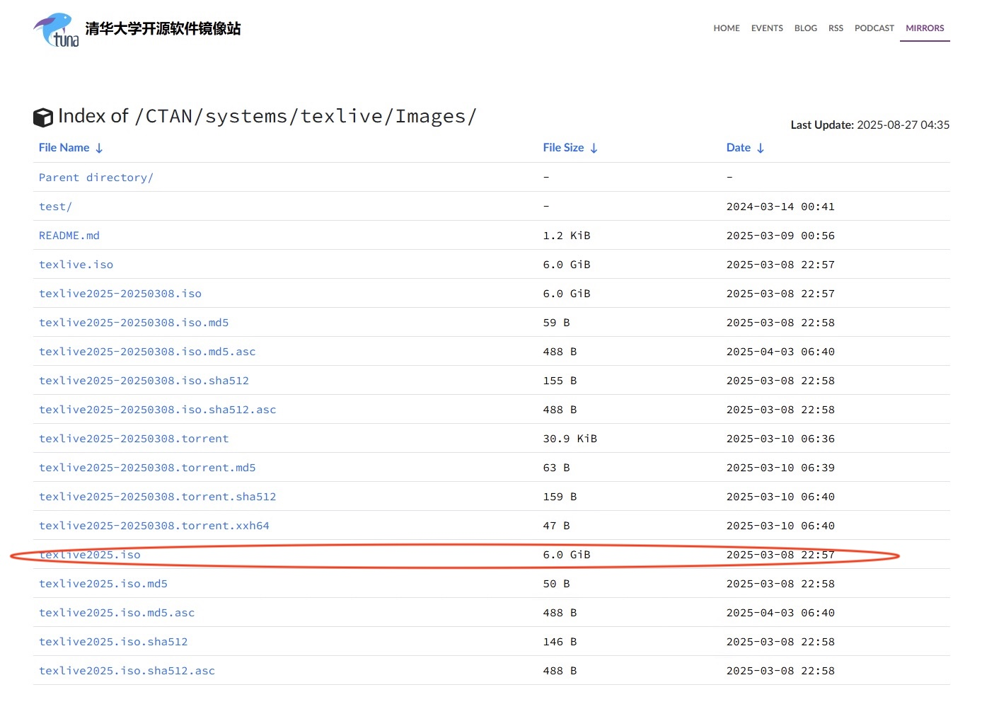
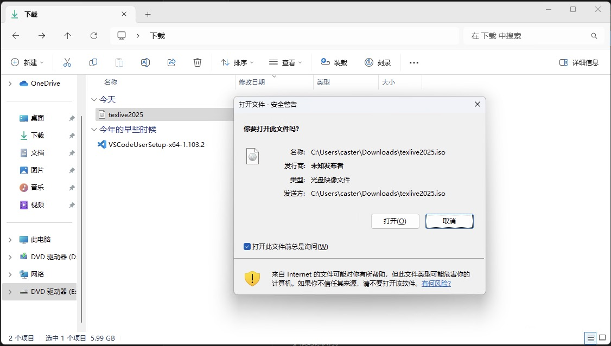
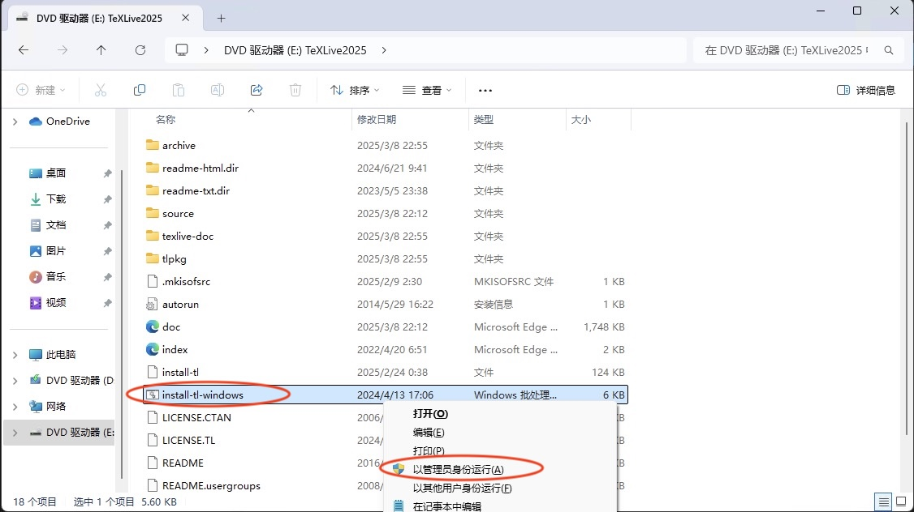
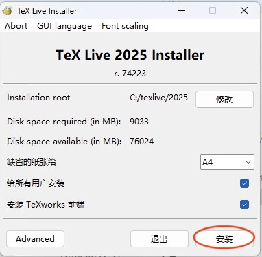
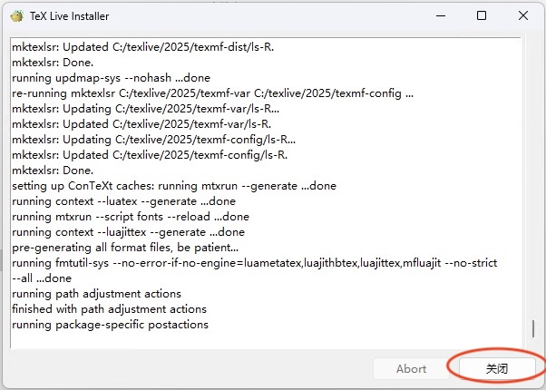
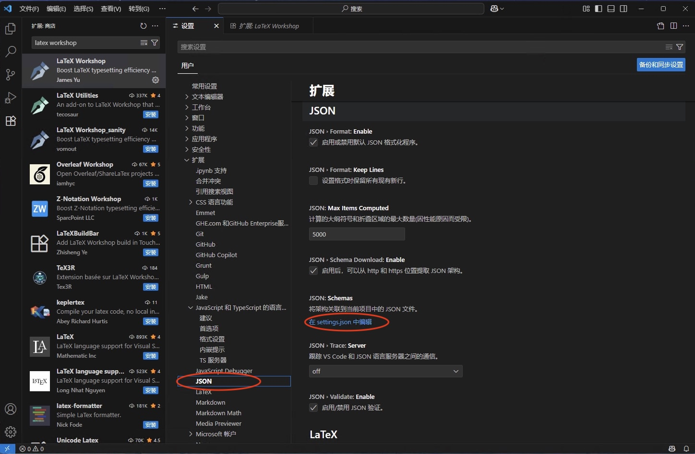
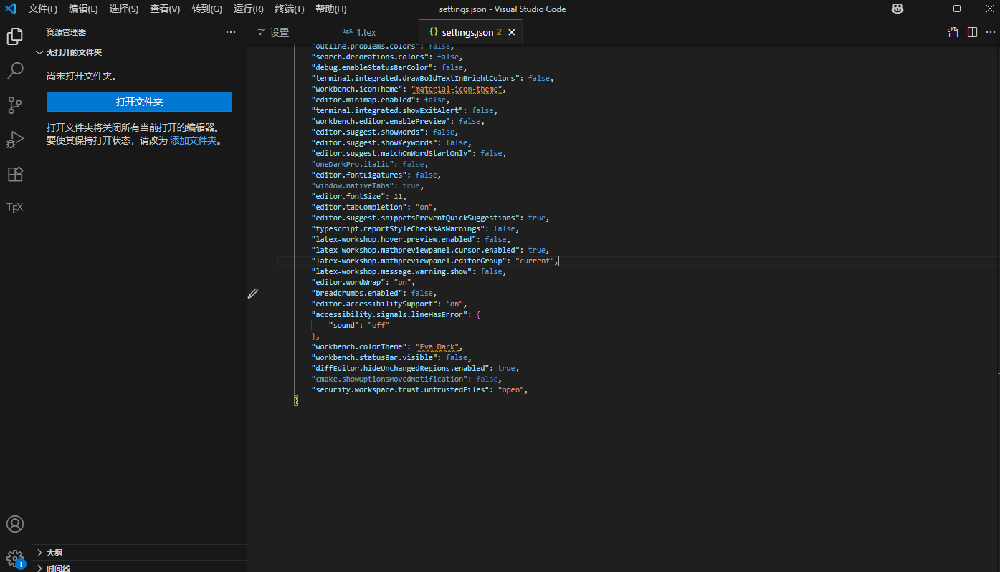
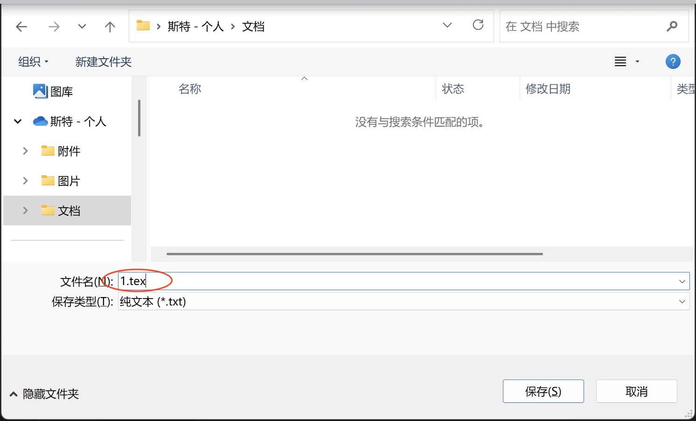
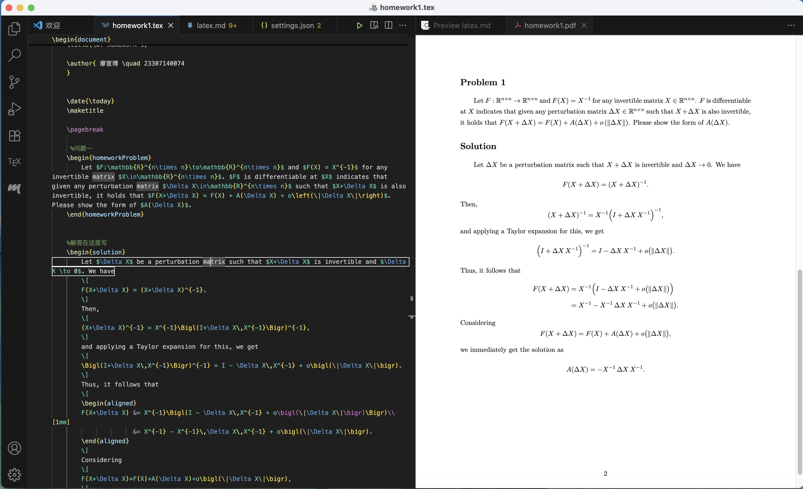
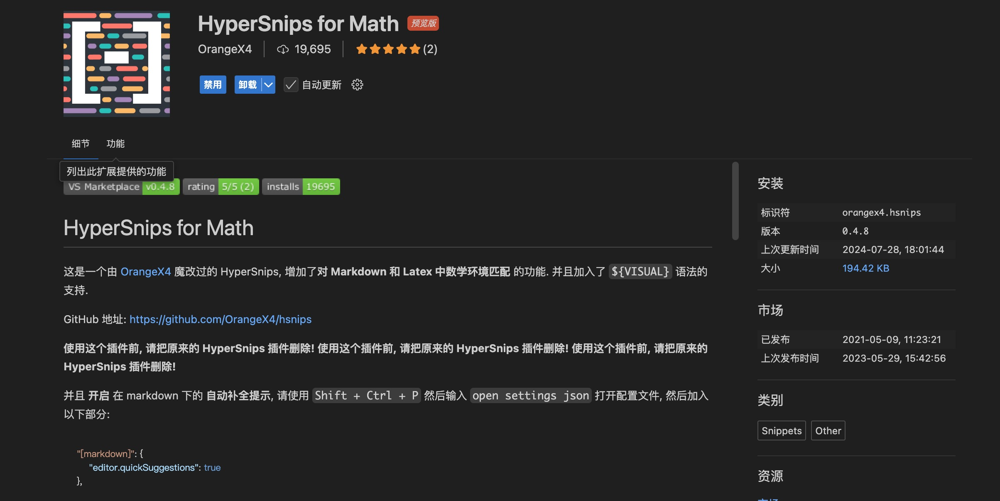

本文介绍了如何在 Visual Studio Code 上部署 LaTeX 本地环境的方法。

<!-- more -->

## Textlive 安装

为了能够在本地部署 $\LaTeX$ ，首先我们需要下载一个 TeX Live 发行版安装包，由于安装包大小很大，因此我们选择清华源镜像下载：[清华源 TeX 安装包下载](https://mirrors.tuna.tsinghua.edu.cn/CTAN/systems/texlive/Images/)选择 `texlive2025.iso`下载（本文写作时间为 2025 年，因此最新版为 2025）：



下载完成后，双击 `iso` 镜像文件打开安装包，如果出现下面的界面选择 `打开`：



下拉文件找到 `install-tl-windows.bat` 文件，`Shift+鼠标右键` 打开菜单选择 `以管理员身份运行`，进入安装页面：



等待一小段时间进入安装页面后，直接点击右下角的 `安装` 进入安装，安装时间很长，大约需要30-50分钟，请耐心等待：



安装完成后，右下角的 `Abort` 变灰，`关闭` 可以点击，选择 `关闭` 后完成安装，默认情况下会自动添加到环境变量中。



## 配置 VS Code 环境

在 VS Code 商店中搜索 `LaTeX Workshop` 插件选择安装：


安装完成后，选择左下角齿轮进入 `设置` 页面，找到 `JSON` 进入页面选择 `在 settings.json 中编辑`：



如果是文件为空，没有其他内容，可以直接用下面的内容替换掉文件内容：

```json
{
  "latex-workshop.latex.recipes": [
    {
      "name": "xelatex",
      "tools": ["xelatex"]
    },
    {
      "name": "xe->bib->xe->xe",
      "tools": ["xelatex", "bibtex", "xelatex", "xelatex"]
    }
  ],

  "latex-workshop.latex.tools": [
    {
      "name": "texify",
      "command": "texify",
      "args": [
        "--synctex",
        "--pdf",
        "--tex-option=\"-interaction=nonstopmode\"",
        "--tex-option=\"-file-line-error\"",
        "%DOC%.tex"
      ]
    },
    {
      // 编译工具和命令
      "name": "xelatex",
      "command": "xelatex",
      "args": ["-synctex=1", "-interaction=nonstopmode", "-file-line-error", "%DOC%"]
    },
    {
      "name": "pdflatex",
      "command": "pdflatex",
      "args": ["-synctex=1", "-interaction=nonstopmode", "-file-line-error", "%DOC%"]
    },
    {
      "name": "bibtex",
      "command": "bibtex",
      "args": ["%DOCFILE%"]
    }
  ],
  "latex-workshop.message.error.show": false,
  "files.autoSave": "afterDelay",
  "latex-workshop.latex.autoBuild.run": "never",
  "editor.fontFamily": "Fira Code ",
  "window.commandCenter": false,
  "workbench.layoutControl.enabled": false,
  "breadcrumbs.showNumbers": false,
  "zenMode.hideLineNumbers": false,
  "outline.showNumbers": false,
  "editor.lineNumbers": "off",
  "breadcrumbs.filePath": "off",
  "breadcrumbs.icons": false,
  "breadcrumbs.showArrays": false,
  "breadcrumbs.showBooleans": false,
  "breadcrumbs.showClasses": false,
  "breadcrumbs.showConstructors": false,
  "breadcrumbs.showConstants": false,
  "editor.bracketPairColorization.independentColorPoolPerBracketType": true,
  "editor.colorDecorators": false,
  "editor.colorDecoratorsActivatedOn": "click",
  "workbench.editor.decorations.colors": false,
  "explorer.decorations.colors": false,
  "outline.problems.colors": false,
  "search.decorations.colors": false,
  "debug.enableStatusBarColor": false,
  "terminal.integrated.drawBoldTextInBrightColors": false,
  "workbench.iconTheme": "material-icon-theme",
  "editor.minimap.enabled": false,
  "terminal.integrated.showExitAlert": false,
  "workbench.editor.enablePreview": false,
  "editor.suggest.showWords": false,
  "editor.suggest.showKeywords": false,
  "editor.suggest.matchOnWordStartOnly": false,
  "oneDarkPro.italic": false,
  "editor.fontLigatures": false,
  "window.nativeTabs": true,
  "editor.fontSize": 11,
  "editor.tabCompletion": "on",
  "editor.suggest.snippetsPreventQuickSuggestions": true,
  "typescript.reportStyleChecksAsWarnings": false,
  "latex-workshop.hover.preview.enabled": false,
  "latex-workshop.mathpreviewpanel.cursor.enabled": true,
  "latex-workshop.mathpreviewpanel.editorGroup": "current",
  "latex-workshop.message.warning.show": false,
  "editor.wordWrap": "on",
  "breadcrumbs.enabled": false,
  "editor.accessibilitySupport": "on",
  "accessibility.signals.lineHasError": {
    "sound": "off"
  },
  "workbench.colorTheme": "Eva Dark",
  "workbench.statusBar.visible": false,
  "diffEditor.hideUnchangedRegions.enabled": true,
  "cmake.showOptionsMovedNotification": false,
  "security.workspace.trust.untrustedFiles": "open"
}
```

否则，在最外层大括号内加入下面内容，注意最后是逗号结尾，修改后的文件应该类似上面的内容：

```json
  "latex-workshop.latex.recipes": [
    {
      "name": "xelatex",
      "tools": ["xelatex"]
    },
    {
      "name": "xe->bib->xe->xe",
      "tools": ["xelatex", "bibtex", "xelatex", "xelatex"]
    }
  ],

  "latex-workshop.latex.tools": [
    {
      "name": "texify",
      "command": "texify",
      "args": [
        "--synctex",
        "--pdf",
        "--tex-option=\"-interaction=nonstopmode\"",
        "--tex-option=\"-file-line-error\"",
        "%DOC%.tex"
      ]
    },
    {
      // 编译工具和命令
      "name": "xelatex",
      "command": "xelatex",
      "args": ["-synctex=1", "-interaction=nonstopmode", "-file-line-error", "%DOC%"]
    },
    {
      "name": "pdflatex",
      "command": "pdflatex",
      "args": ["-synctex=1", "-interaction=nonstopmode", "-file-line-error", "%DOC%"]
    },
    {
      "name": "bibtex",
      "command": "bibtex",
      "args": ["%DOCFILE%"]
    }
  ],
  "latex-workshop.message.error.show": false,
  "files.autoSave": "afterDelay",
  "latex-workshop.latex.autoBuild.run": "never",
  "editor.fontFamily": "Fira Code ",
  "window.commandCenter": false,
  "workbench.layoutControl.enabled": false,
  "breadcrumbs.showNumbers": false,
  "zenMode.hideLineNumbers": false,
  "outline.showNumbers": false,
  "editor.lineNumbers": "off",
  "breadcrumbs.filePath": "off",
  "breadcrumbs.icons": false,
  "breadcrumbs.showArrays": false,
  "breadcrumbs.showBooleans": false,
  "breadcrumbs.showClasses": false,
  "breadcrumbs.showConstructors": false,
  "breadcrumbs.showConstants": false,
  "editor.bracketPairColorization.independentColorPoolPerBracketType": true,
  "editor.colorDecorators": false,
  "editor.colorDecoratorsActivatedOn": "click",
  "workbench.editor.decorations.colors": false,
  "explorer.decorations.colors": false,
  "outline.problems.colors": false,
  "search.decorations.colors": false,
  "debug.enableStatusBarColor": false,
  "terminal.integrated.drawBoldTextInBrightColors": false,
  "workbench.iconTheme": "material-icon-theme",
  "editor.minimap.enabled": false,
  "terminal.integrated.showExitAlert": false,
  "workbench.editor.enablePreview": false,
  "editor.suggest.showWords": false,
  "editor.suggest.showKeywords": false,
  "editor.suggest.matchOnWordStartOnly": false,
  "oneDarkPro.italic": false,
  "editor.fontLigatures": false,
  "window.nativeTabs": true,
  "editor.fontSize": 11,
  "editor.tabCompletion": "on",
  "editor.suggest.snippetsPreventQuickSuggestions": true,
  "typescript.reportStyleChecksAsWarnings": false,
  "latex-workshop.hover.preview.enabled": false,
  "latex-workshop.mathpreviewpanel.cursor.enabled": true,
  "latex-workshop.mathpreviewpanel.editorGroup": "current",
  "latex-workshop.message.warning.show": false,
  "editor.wordWrap": "on",
  "breadcrumbs.enabled": false,
  "editor.accessibilitySupport": "on",
  "accessibility.signals.lineHasError": {
    "sound": "off"
  },
  "workbench.colorTheme": "Eva Dark",
  "workbench.statusBar.visible": false,
  "diffEditor.hideUnchangedRegions.enabled": true,
  "cmake.showOptionsMovedNotification": false,
  "security.workspace.trust.untrustedFiles": "open",
```

修改完成后，保存文件并重启 VS Code：



## 本地编写 LaTeX 文件

### 编译文件

在文件夹中 `Ctrl+N` 新建文件，通过 `Ctrl+S` 保存为 `.tex` 结尾文件格式：



可以用下面的内容进行测试：

```latex
\documentclass[12pt, a4paper, oneside]{ctexart}

\begin{document}

hello world!

$$\sum_{i=1}^{n} a_i = n $$

你好，世界！

\end{document}
```

此时左边应该出现了 `TEX` 栏，点击绿色运行按钮进行编译文件，点击旁边的按钮查看 PDF，如图所示即成功：


### 正向跳转与反向跳转

在 Mac 设备下，选择要正向跳转的内容，比如下图中在 tex 源文件中选择了 Taylor，按下 `Command+Option+J` 即可在右侧预览 PDF 文件中看见标红区域，即为正向跳转；在 Windows 系统下，同前操作，但是快捷键改为 `Ctrl+Alt+J`：


在 Mac 设备下，按下 `Command` 的同时在 PDF 源文件中左键要反向跳转的内容，比如下图中的 matrix，即可在 `tex` 源文件中看见对应的源代码用框标注，即为反向跳转；在 Windows 系统下，改为 `Ctrl+鼠标左键`，其余同理：



## 自动补全插件

在平时写 tex 源文件的数学公式时，我们可能因为要去输入 `\frac{}{}` 来渲染分数线，输入 `_{}` 来渲染下标，输入 `\displaystyle` 来渲染完整数学公式，这些各种需要 `\` 或者 `_` 的关键字会降低我们的写作速度，因此使用 VS Code 中的 `HyperSnips For Math` 插件可以帮助我们加速写作，比如下面所示：


首先在 VS Code 的扩展中搜索 `HyperSnips For Math` 找到对应插件并安装：



安装后，参照前文内容打开 `settings.json` 文件，在最外层大括号内加入如下内容，目的是在 tex 源文件中和 markdown 文件中均能启用自动补全插件：

```json
  "[latex]": {
      "editor.quickSuggestions": {
          "comments": "on",
          "strings": "on",
          "other": "on"
      }
  },
  "[markdown]": {
      "editor.quickSuggestions": {
          "comments": "on",
          "strings": "on",
          "other": "on"
      }
  },
```

保存 `settings.json` 文件后，在 [https://github.com/OrangeX4/OrangeX4-HyperSnips](https://github.com/OrangeX4/OrangeX4-HyperSnips) 中下载 `latex.hsnips` 和 `markdown.hsnips` 文件，回到 VS Code 按下 `Ctrl+Shift+P` （在 Mac 电脑中为 `Command+Shift+P` ）后输入命令 `Open Snippets Directory` 后打开文件夹，并将前面下载的 `latex.hsnips` 和 `markdown.hsnips` 文件放入文件夹中：


重启 VS Code 后就可以在 `tex` 源文件或者 markdown 文件中的 **数学环境** 中使用插件，常见的补全如下所示，更多拓展可以通过询问 AI 关于 `latex.hsnips` 中的文件内容得到：

- 分数线：输入 `//` 自动拓展为 `\frac{}{}` ，输入 `表达式 + /` 自动拓展为 `/frac{表达式}{}`
- 比较符号：输入 `<=` 自动拓展为 `\le`，输入 `>=` 自动拓展为 `\ge` ，输入 `!=` 自动拓展为 `\neq` ，输入 `+-` 自动拓展为 `\pm`
- 下标：在字母或者希腊字母后面直接写数字，可以拓展为下标，比如输入 `a1` 自动拓展为 `a_1` ；输入 `td` 则会拓展为`_{}`
- 希腊字母：无需添加反斜杠，自动补全，比如输入 `alpha` 自动填充为 `\alpha`

如果在正常代码中意外触发了补全，而又不想自动补全的时候，按下 `Ctrl+Z` 即可撤销操作。
