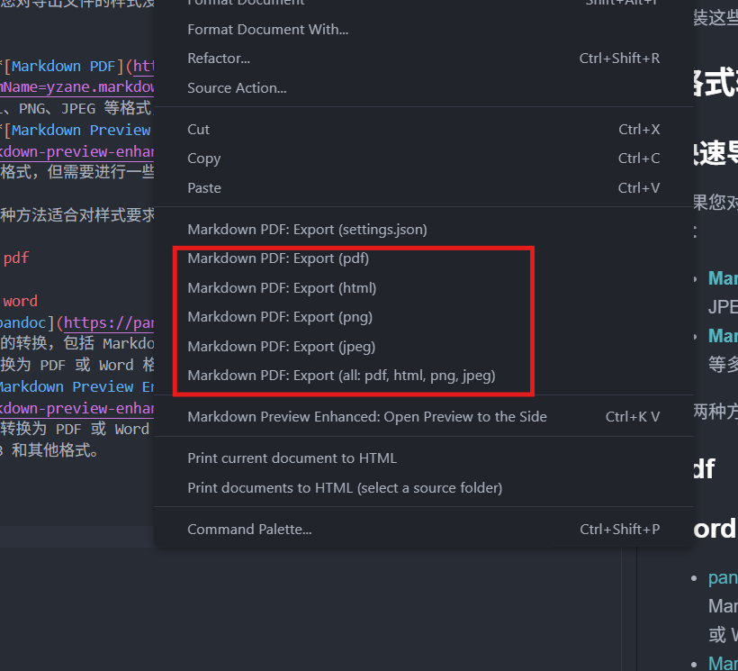

从 ChatGPT、DeepSeek 等 AI 对话直达 PDF、Word 文档

<!-- more -->

## 关于 Markdown

- Markdown 是一种轻量级的标记语言，常用于编写格式化文本。它的语法简单易懂，适合快速撰写和编辑文档。
- 在网页中，AI 回答通常以 Markdown 格式渲染为可视化内容，方便阅读和理解。
- 然而，直接鼠标选中复制时，可能会丢失部分格式或导致排版混乱。
- 如果点击对话末尾的复制按钮，得到的内容是 Markdown 源码，需要额外处理以满足特定的格式需求。
- 本文将介绍如何将 Markdown 文件直接转换为符合需求的 pdf、word 等格式文档，也会补充其他的实用工具和技巧。
- 有关 Markdown 语法的内容，复旦大学开放原子开源社团 FDUCSLG 的[ COMP101 ](https://comp101.fducslg.com/tools/markdown1)教程已有充分的介绍。不必担心，即使你从未学习过使用 Markdown，也能通过本文轻松上手。

## 使用工具

### 编辑工具选择

本教程选择使用 **VS Code** 作为编辑工具，主要基于以下理由：

- **插件生态完善**：VS Code 拥有丰富的插件市场，提供了多种 Markdown 插件，可以满足从实时预览到格式转换的各种需求。
- **跨平台支持**：VS Code 支持 Windows、macOS 和 Linux，确保用户在不同操作系统上都能获得一致的体验。
- **自定义能力**：支持用户根据需求自定义界面和快捷键，提升使用体验。

## 格式转换

### 快速导出

如果您对导出文件的样式没有特别要求，可以直接使用以下工具快速导出为多种格式：

- **[Markdown PDF](https://marketplace.visualstudio.com/items?itemName=yzane.markdown-pdf)**：支持直接将 Markdown 文件导出为 PDF、HTML、PNG、JPEG 等格式，操作简单，无需额外配置即可使用。
  
- **[Markdown Preview Enhanced](https://shd101wyy.github.io/markdown-preview-enhanced/#/)**：支持导出为 PDF、Word、HTML、EPUB 等多种格式，但需要进行一些额外配置以启用特定功能。

这两种方法适合对样式要求不高的用户，能够快速满足基本的格式转换需求。

### pdf

### word

- [pandoc](https://pandoc.org/) 是一个强大的文档转换工具，支持多种格式之间的转换，包括 Markdown、HTML、PDF 和 Word 等。它可以将 Markdown 文件转换为 PDF 或 Word 格式，支持自定义样式和模板。需要注意的是
- [Markdown Preview Enhanced](https://shd101wyy.github.io/markdown-preview-enhanced/#/) 是一个 VS Code 插件，可以将 Markdown 文件转换为 PDF 或 Word 格式，支持自定义样式和模板。它还支持导出为 HTML、EPUB 和其他格式。
