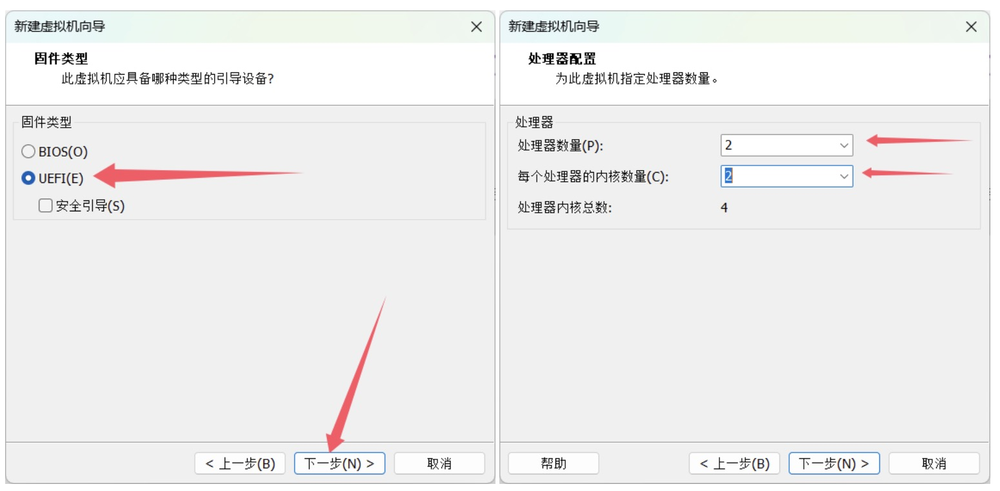
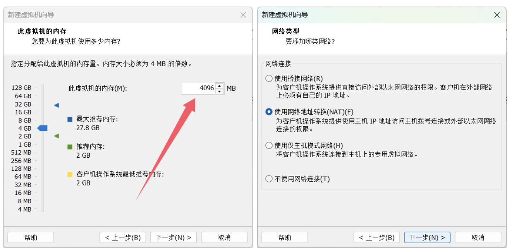

本文介绍了 VMware 虚拟机安装 Windows 8.1 和 Ubuntu 虚拟机的方法。

<!-- more -->

## VMware 的下载与安装

VMware 在 2023 年已经被博通收购，许可证调整后个人用户可以免费使用该软件，可以在 [https://softwareupdate.vmware.com/cds/vmw-desktop/](https://softwareupdate.vmware.com/cds/vmw-desktop/) 中下载，进入该页面后 Windows 用户选择 Directories 中的 `ws`，进入版本选择，比如可以选择 `17.6.0`，再选择一串数字，选择 `windows`，选择 `core`，选择安装包的压缩文件 `VMware-workstation-17.6.0-24238078.exe.tar` 进行下载：


下载后对压缩包进行解压，得到安装文件，双击运行软件进入安装界面，进入安装向导页面后，点击 `下一步`，勾选同意条款后点击 `下一步`，勾选添加到系统PATH后点击 `下一步` 进入用户体验设置界面，可以根据自己的喜好进行勾选，点击 `下一步` 进入快捷方式，默认勾选即可，点击 `下一步` 后选择 `完成`，这个时候桌面将生成软件图标，打开后显示欢迎界面，选择 `将 VMware Workstation 17 用于个人用途` 后即可使用。


## Windows 虚拟机安装

由于部分软件只能运行在 Windows 10 以前的版本!!没错这篇教程就是给你写的 ISE!!，而 Windows 7 运行较为卡顿，因此本文以 Windows 8.1 安装为例，Windows 7 和 Windows 10 虚拟机较为类似。首先从网络中下载 Windows 8.1 镜像，可以参考[施工中](404)，将其保存至本地。

首先双击桌面上的图标，进入 VMware 主页，选择新建虚拟机后选择 `自定义安装` 后点击 `下一步`：


对于硬件兼容性，如果是配置 Windows 8.1 或是 Windows 7 这类早期版本，建议选择 `Workstation 15.x`, 如果是 Windows 10 等后期版本可以选择默认的 `Workstation 17.5 or later`, 选择后点击 `下一步`，进入 `安装客户机操作系统` 页面，选择 `稍后安装操作系统` 后点击 `下一步`：


进入选择操作系统页面，选择第一排的 `Microsoft Windows` 后在版本选择对应的版本，比如本文示例为 `Windows 8.x x64`，点击 `下一步`，按照自己喜欢命名虚拟机名称，这里建议使用纯英文或数字的命名方式（不推荐使用中文名），位置默认会安装在 `C` 盘的 `Documents` （文稿）目录下的 `Vistual Machines` 文件夹中，对于大多数用户推荐点击浏览选择 `D` 盘中的文件目录，以免 `C` 盘空间紧张：


进入固件类型选择，对于 Windows 8 及其以后的版本可以选择默认的 `UEFI`，如果是 Windows 7 需要选择 `BIOS`，点击 `下一步`，处理器配置根据自己电脑配置选择，建议选择处理器数量为 2，每个处理器内核数量为 2，点击 `下一步`：



进入虚拟机内存设置界面，对于大多数用户建议设置为 `4096MB`，也可以设置更大内存，但请不要超过 `最大推荐内存`，点击 `下一步` 选择 `使用网络地址转换` 后点击 `下一步`：



在 `I/O 控制器类型` 选择默认推荐的 `LSI Logic SAS`，点击 `下一步`，在磁盘选择类型中选择默认推荐的 `SCSI` 后点击 `下一步`：


进入选择磁盘界面，选择第一个 `创建新虚拟磁盘` 后点击 `下一步`，设置最大磁盘大小，这里最好不要低于它建议的 `60GB` 大小，不要勾选 `立即分配所有磁盘空间`，否则会立刻在电脑中占据最大磁盘大小的空间，建议下面选择 `将虚拟磁盘存储为单个文件`：


进入指定磁盘文件页面，这里默认不用管即可，点击 `下一步`，选择 `自定义硬件` 进入界面：


进入自定义界面后，选择左侧的 `新 CD/DVD(SATA)`，在右侧 `连接` 中选择 `使用 ISO 映像文件`，点击浏览选择之前保存的 ISO 镜像文件，文件格式通常以 .iso 结尾，完成操作后点击下方的 `关闭`，选择 `完成` 完成配置。


完成配置后回到主页，选择 `开启此虚拟机` 进入虚拟机：


如果开启后显示 `Press any key to boot from cd or dvd` 请快速按下任何一个字母键，如果按下之后卡在页面不动，可以进行如下操作，选择导航栏中的 `虚拟机` 后选择 `设置` 进入设置页面，选择上方的 `选项` 后，选择最下面的 `高级`，将固件类型修改为 `BIOS` 后点击 `确定` 后再次启动即可：


启动成功后，进入下方页面：


等待一段时间后进入 Windows 安装程序页面，语言如图选择默认的即可，选择 `下一步` 继续：


这里点击 `现在安装`：


然后输入密钥激活 Windows，由于 Windows 8.1 已经是很早期的操作系统了，在网络上可以很容易搜到密钥：


点击 `我接受许可条款` 后点击“下一步”：


这里选择第二个 `自定义：仅安装 Windows（高级）`：


然后等待安装完成即可，这个过程中虚拟机内频繁重启是正常现象：


进入个性化页面，按自己喜好选择一个颜色后，在下方 `电脑名称` 中填写名称，同样建议这里纯英文或数字填写名称：


进入设置界面后点击右下角的 `自定义`：


在设置页面中选择第一个 `是 对于家庭或工作网络`：


在设置页面中 Windows 更新建议选择 `不设置 Windows 更新`，下面设置建议都选择为 `关`：


其余选项选择按自己喜好选择即可：


进入账号设置页面，选择 `创建本地账户`，或者如果弹出 Microsoft 登陆页面，可以选择左下角的 `不使用 Microsoft 账户登录`：


在账户设置中按自己需求设置用户名和密码以及密码提示，同样建议用户名不使用中文名称：


完成设置后进入 Windows 8.1 桌面如下所示：


这个时候我们发现如果改变 VMware 窗口大小，虚拟机内的桌面大小不会随之改变，这是因为还没有安装 VMware Tools 工具，选择导航栏的 `虚拟机` 后选择 `安装 VMware Tools`：


进入安装页面后耐心等待安装结束：


再同时按下键盘的 `Win+R` 打开运行，输入 `D:\setup.exe` 后点击确定，进入 VMware Tools 安装程序：


安装页面点击 `下一步`：


选择 `典型安装`：


等待安装完成后点击 `完成`，系统将自动重新启动，完成安装：


安装好 VMware Tools 后除了能自适应调节桌面大小，还可以进行文件拖拽传输，可以将实体机的文件直接拖入虚拟机，如果无法拖入，可以先使用快捷键 `Ctrl+C` 复制实体机文件后，在虚拟机内使用快捷键 `Ctrl+V` 粘贴文件，完成这一次操作后应当可以正常拖拽文件或复制粘贴文件。

## Linux 虚拟机安装

对于大多数人，建议从安装 Ubuntu 操作系统入手。首先下载 Ubuntu 镜像源，进入[中科大镜像站](http://mirrors.ustc.edu.cn/)，下拉页面找到 `ubuntu-releases` 点击进入，选择版本，推荐使用稳定的 `20.04`, 点击进入后选择 `ubuntu-20.04.6-desktop-amd64.iso` 下载到本地：


双击桌面的 VMware 软件图标进入页面，选择 `创建新的虚拟机`，选择 `自定义`，点击 `下一步`，默认选择 `Workstation 17.5 or later` 即可，点击 `下一步`：


进入安装客户机操作系统界面，选择 `安装程序光盘映像文件` 选择 `浏览` 找到前面下载好的镜像文件，系统将自动检测到为 `Ubuntu 64 位` 操作系统，点击 `下一步`，设置自己的用户名和密码，这里全部建议不使用中文名称，设置好后点击 `下一步`：


虚拟机名称可根据自己喜好设置，这里是否为中文不影响使用，位置默认会安装在 `C` 盘的 `Documents` (文稿)目录下的 `Vistual Machines` 文件夹中，对于大多数用户推荐点击浏览选择 `D` 盘中的文件目录，以免 `C` 盘空间紧张，处理器核数根据自己电脑配置设置，建议默认位 2 个处理器，每个处理器内核数量为 2：


进入内存设置页面，建议设置为默认的 `4096MB` 内存大小，可以根据自己电脑内存大小进行调整，但不要超过最大推荐内存，接下来网络类型选择 `使用网络地址转换`：


在 `I/O 控制器类型` 选择默认推荐的 `LSI Logic SAS`，点击 `下一步`，在磁盘选择类型中选择默认推荐的 `SCSI` 后点击 `下一步`：


选择磁盘建议选择第一项 `创建新虚拟磁盘`，选择后点击 `下一步`，磁盘大小可根据需求选择，下面选择 `将虚拟磁盘存储为单个文件`：


然后点击 `下一步` 和 `完成` 后进入虚拟机主页，选择 `开启此虚拟机`：


开启后进入如下耐心等待安装即可，途中可能会进行多次重启，是正常现象：


最后进入登陆界面，输入此前设定的密码登入：


进入桌面，即可正常使用，中科大源的 Ubuntu 已经内置安装好了 VMware tools，因此无需再次安装即可缩放页面和拖拽文件，如果采用了其他源的 Ubuntu，可根据前文 Windows 虚拟机的操作安装 VMware Tools 工具：<!-- TODO 有没有自带似乎与源无关，且安装需要在源里装 open vm tools -->


如果仍然无法通过拖拽的方式将文件移入虚拟机中，可能尝试再安装一下 `open-vm-tools-desktop`，具体操作为在桌面右键选择 `Open in Terminal` 打开终端，输入以下指令后输入密码完成安装，安装完成后注销虚拟机后再进入即可：

```bash
sudo apt update
sudo apt install open-vm-tools-desktop -y
```

## 使用 VMware 打开别人给的虚拟机

有时候在课程教学中，教师会在虚拟机中已经安装好一些软件和环境后将虚拟机打包给学生使用，因此无需从头开始装虚拟机，而是直接打开即可。VMware 软件的下载前文已经展示，此处不再赘述。

考虑到虚拟机大小普遍偏大，即使是压缩后普遍也在 10GB 大小以上，许多助教会选择分卷压缩的方式。对于分卷压缩，首先需要将所有压缩文件下载至本地，选中文件名结尾为 `.part01` 的文件，按下 `Shift+鼠标右键` 打开拓展菜单选择自己的压缩软件进行解压（经测试，目前 Windows 系统自带的解压无法处理正常处理分卷压缩），最终得到一个完整的文件夹（解压后请检查文件夹大小，至少比解压前的压缩包大小总和更大，否则可能没有分卷解压成功），以 7zip 为例，如下图所示：


打开 VMware 软件，选择 `打开虚拟机`，在浏览中找到此前解压好的文件夹，选择进入：


双击文件夹，找到文件类型为 `VMware 虚拟机配置` 类型的文件（通常显示的只有一个），选择 `打开`：


软件加载完毕虚拟机后，选择 `开启此虚拟机`，进入虚拟机内部，此时通常会出现 `此虚拟机可能已被移动或复制` 的窗口，选择 `我已移动该虚拟机` 后即可正常使用：


## 虚拟机的其他使用建议

当虚拟机使用结束后，推荐将虚拟机挂起，而不是关闭虚拟机，方便下次使用时直接打开，具体操作：选择导航栏中的 `虚拟机`，选择 `电源`，选择 `挂起客户机` 后再关闭软件页面：


不过这样操作相当于一直没有关闭虚拟机，虚拟机可能会因为长时间运行发生卡顿，这时候可以重启一次。
